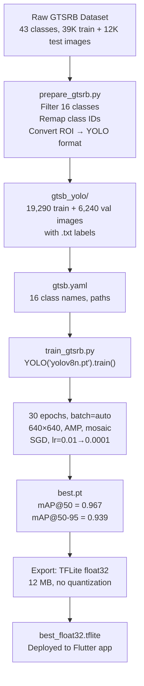

# Model Explanation — `train_gtsrb_full` (Float32)

> **Model**: YOLOv8n (nano) — Object Detection
> **Run name**: `train_gtsrb_full`
> **Precision**: Float32 (no quantization)
> **Trained on**: 2026-03-26
> **Framework**: Ultralytics v8.4.21 + PyTorch

---

## 1. The Dataset — GTSRB (German Traffic Sign Recognition Benchmark)

### 1.1 What is GTSRB?

The **GTSRB** is a large-scale, multi-class benchmark for traffic sign recognition. It contains real-world images of German traffic signs captured from dashcam video sequences.

| Property | Value |
|----------|-------|
| **Full name** | German Traffic Sign Recognition Benchmark |
| **Total classes** | 43 (class IDs 0–42) |
| **Total train images** | 39,209 |
| **Total test images** | 12,630 |
| **Image format** | PNG |
| **Image sizes** | Variable (25×25 to 243×225 px, mean ≈ 51×50 px) |
| **Annotation format** | CSV with bounding-box ROI columns |

The raw dataset lives at: `gtsb/`
```
gtsb/
├── Train/           # 43 subdirectories (0–42), one per class
│   ├── 0/           # images for class 0
│   ├── 1/           # images for class 1
│   └── ...42/
├── Test/            # flat directory of test images
├── Train.csv        # 39,209 rows — annotations for training images
├── Test.csv         # 12,630 rows — annotations for test images
├── Meta.csv         # class metadata (shape, color, sign ID)
└── Meta/            # reference sign images per class
```

**CSV columns**: `Width, Height, Roi.X1, Roi.Y1, Roi.X2, Roi.Y2, ClassId, Path`

Each row provides the image path, the bounding-box ROI coordinates of the sign within the image, and the original GTSRB class ID.

---

### 1.2 Class Subset — 16 out of 43 Classes

Only **16 classes** relevant to the SteerMate ADAS project were selected from the full 43-class GTSRB. The selection was done in [prepare_gtsrb.py](file:///home/john/work/remove-after/traffic-sign-training/prepare_gtsrb.py).

#### Class Mapping (GTSRB → YOLO)

| GTSRB ClassId | YOLO Index | Label | Train Images | Test/Val Images |
|:---:|:---:|---|---:|---:|
| 0 | 0 | Speed Limit 20 | 210 | 60 |
| 1 | 1 | Speed Limit 30 | 2,220 | 720 |
| 2 | 2 | Speed Limit 50 | 2,250 | 750 |
| 3 | 3 | Speed Limit 60 | 1,410 | 450 |
| 4 | 4 | Speed Limit 70 | 1,980 | 660 |
| 5 | 5 | Speed Limit 80 | 1,860 | 630 |
| 7 | 6 | Speed Limit 100 | 1,440 | 450 |
| 8 | 7 | Speed Limit 120 | 1,410 | 450 |
| 19 | 8 | Left Curve | 210 | 60 |
| 20 | 9 | Right Curve | 360 | 90 |
| 27 | 10 | Pedestrian Crossing | 240 | 60 |
| 15 | 11 | No Vehicles | 630 | 210 |
| 28 | 12 | School Ahead | 540 | 150 |
| 38 | 13 | Keep Right | 2,070 | 690 |
| 39 | 14 | Keep Left | 300 | 90 |
| 13 | 15 | Give Way | 2,160 | 720 |

**Totals after filtering:**

| Split | Images |
|-------|--------|
| Train | **19,290** |
| Val (from Test.csv) | **6,240** |
| **Combined** | **25,530** |

> [!IMPORTANT]
> GTSRB class IDs 6, 9–12, 14, 16–18, 21–26, 29–37, 40–42 were all **discarded**. Only the 16 classes above were kept. The GTSRB `Test.csv` split was used as the **validation** set during training (there is no separate held-out test set).

---

## 2. Data Preparation Pipeline — `prepare_gtsrb.py`

**Script**: [prepare_gtsrb.py](file:///home/john/work/remove-after/traffic-sign-training/prepare_gtsrb.py)

This script converts the raw GTSRB CSV-annotated dataset into **YOLO darknet format** that Ultralytics can consume.

### 2.1 What It Does (Step by Step)

1. **Reads** `gtsb/Train.csv` and `gtsb/Test.csv`
2. **Filters** rows to keep only the 16 target classes (using the `class_mapping` dict)
3. **Remaps** the original GTSRB ClassId to a contiguous 0–15 YOLO index
4. **Converts bounding boxes** from absolute pixel ROI `(x1, y1, x2, y2)` to **YOLO normalized center format** `(cx, cy, w, h)`:
   ```
   cx = ((x1 + x2) / 2) / image_width
   cy = ((y1 + y2) / 2) / image_height
   w  = (x2 - x1) / image_width
   h  = (y2 - y1) / image_height
   ```
5. **Copies** each image into the YOLO directory structure
6. **Writes** one `.txt` label file per image: `<class_id> <cx> <cy> <w> <h>`

### 2.2 Output Structure

```
gtsb_yolo/
├── train/
│   ├── images/    # 19,290 PNG files (flattened names like Train_0_00000_00000_00000.png)
│   └── labels/    # 19,290 TXT files (one label per image, one detection per line)
└── val/
    ├── images/    # 6,240 PNG files
    └── labels/    # 6,240 TXT files
```

**Example label file** (`Train_0_00000_00000_00000.txt`):
```
0 0.500000 0.516667 0.655172 0.633333
```
This means: class 0 (Speed Limit 20), centered at (50%, 51.7%), box width 65.5%, box height 63.3% of the image.

> [!NOTE]
> Each image in GTSRB contains exactly **one** traffic sign, so every label file has exactly **one line**.

### 2.3 Dataset YAML Config

**File**: [gtsb.yaml](file:///home/john/work/remove-after/traffic-sign-training/gtsb.yaml)

```yaml
path: /home/john/work/remove-after/traffic-sign-training/gtsb_yolo
train: train/images
val: val/images
test: val/images         # same as val — no separate test set

nc: 16
names: [
  'Speed Limit 20',  'Speed Limit 30',  'Speed Limit 50',
  'Speed Limit 60',  'Speed Limit 70',  'Speed Limit 80',
  'Speed Limit 100', 'Speed Limit 120', 'Left Curve',
  'Right Curve',     'Pedestrian Crossing', 'No Vehicles',
  'School Ahead',    'Keep Right',      'Keep Left',
  'Give Way'
]
```

---

## 3. The Training Script — `train_gtsrb.py`

**Script**: [train_gtsrb.py](file:///home/john/work/remove-after/traffic-sign-training/train_gtsrb.py)

This is the **exact script** that produced the `train_gtsrb_full` run. It does 5 things:

### 3.1 Step-by-Step Breakdown

#### Step 1 — Train the Model (lines 36–49)

```python
model = YOLO('yolov8n.pt')               # load pre-trained YOLOv8-nano
Result_Final_model = model.train(
    data=DATA_YAML,                        # gtsb.yaml (16-class config)
    epochs=30,                             # 30 full epochs
    batch=-1,                              # auto-detect optimal batch size for GPU
    optimizer='auto',                      # Ultralytics picks SGD or AdamW based on model
    device=0 if torch.cuda.is_available() else 'cpu',
    project='runs/detect',
    name='train_gtsrb_full',               # ← this names the output directory
    exist_ok=True,
)
```

#### Step 2 — Save Training Result Plots (lines 55–70)

Copies confusion matrix and results plots from the training output to the project root with `gtsrb_result_` prefix.

#### Step 3 — Validate (lines 72–76)

```python
Valid_model = YOLO(BEST_WEIGHTS)       # load best.pt
metrics = Valid_model.val(split='val')  # run validation on val split
```

#### Step 4 — Visual Predictions on Val Set (lines 78–97)

Randomly samples 9 validation images, runs inference at `conf=0.5`, and saves an annotated 3×3 grid to `gtsrb_test_predictions.png`.

#### Step 5 — Export to TFLite (lines 99–102)

```python
Valid_model.export(format='tflite', imgsz=640, int8=False)
```

This exports the model as **float32 TFLite** (no quantization, since `int8=False`).

---

## 4. Complete Training Hyperparameters

All parameters recorded in [args.yaml](file:///home/john/work/remove-after/traffic-sign-training/runs/detect/train_gtsrb_full/args.yaml):

### 4.1 Core Training Config

| Parameter | Value | Meaning |
|-----------|-------|---------|
| `model` | `yolov8n.pt` | YOLOv8 **nano** — smallest/fastest variant |
| `pretrained` | `true` | Transfer learning from COCO pre-trained weights |
| `epochs` | `30` | Total training epochs |
| `batch` | `-1` | Auto-detect max batch size for available GPU VRAM |
| `imgsz` | `640` | All images resized to 640×640 for training |
| `device` | `0` | First CUDA GPU |
| `optimizer` | `auto` | Ultralytics auto-selects (typically SGD for detection) |
| `amp` | `true` | Automatic Mixed Precision — speeds up GPU training |
| `seed` | `0` | Deterministic reproducibility |
| `deterministic` | `true` | Forces deterministic CUDA ops |
| `fraction` | `1.0` | Use 100% of the dataset |
| `patience` | `100` | Early stopping patience (never triggered in 30 epochs) |
| `close_mosaic` | `10` | Disable mosaic augmentation for last 10 epochs |
| `workers` | `8` | Dataloader worker threads |

### 4.2 Learning Rate Schedule

| Parameter | Value |
|-----------|-------|
| `lr0` | `0.01` (initial learning rate) |
| `lrf` | `0.01` (final LR = lr0 × lrf = 0.0001) |
| `warmup_epochs` | `3.0` |
| `warmup_momentum` | `0.8` |
| `warmup_bias_lr` | `0.1` |
| `cos_lr` | `false` (linear decay, not cosine) |

### 4.3 Optimizer

| Parameter | Value |
|-----------|-------|
| `momentum` | `0.937` |
| `weight_decay` | `0.0005` |
| `nbs` | `64` (nominal batch size for loss normalization) |

### 4.4 Loss Weights

| Loss | Weight | Purpose |
|------|--------|---------|
| `box` | `7.5` | Bounding box regression loss (CIoU) |
| `cls` | `0.5` | Classification loss (BCE) |
| `dfl` | `1.5` | Distribution Focal Loss (fine-grained bbox) |

### 4.5 Data Augmentation

| Augmentation | Value | Effect |
|-------------|-------|--------|
| `mosaic` | `1.0` | 100% chance — combines 4 images into one (disabled last 10 epochs) |
| `hsv_h` | `0.015` | Hue shift ±1.5% |
| `hsv_s` | `0.7` | Saturation shift ±70% |
| `hsv_v` | `0.4` | Value/brightness shift ±40% |
| `translate` | `0.1` | Random translation ±10% |
| `scale` | `0.5` | Random scale ±50% |
| `fliplr` | `0.5` | 50% horizontal flip |
| `flipud` | `0.0` | No vertical flip |
| `degrees` | `0.0` | No rotation |
| `shear` | `0.0` | No shear |
| `perspective` | `0.0` | No perspective transform |
| `mixup` | `0.0` | No mixup |
| `copy_paste` | `0.0` | No copy-paste |
| `erasing` | `0.4` | 40% random erasing |
| `auto_augment` | `randaugment` | Random augmentation policy |

### 4.6 Validation/Inference Config

| Parameter | Value |
|-----------|-------|
| `iou` (NMS threshold) | `0.7` |
| `max_det` | `300` |
| `half` | `false` |
| `single_cls` | `false` |
| `rect` | `false` (square inference, not rectangular) |

---

## 5. Training Results — Epoch-by-Epoch

Data from [results.csv](file:///home/john/work/remove-after/traffic-sign-training/runs/detect/train_gtsrb_full/results.csv):

### 5.1 Key Milestones

| Epoch | Train Box Loss | Train Cls Loss | Train DFL Loss | Precision | Recall | mAP@50 | mAP@50-95 | Val Box Loss | Val Cls Loss |
|:---:|:---:|:---:|:---:|:---:|:---:|:---:|:---:|:---:|:---:|
| 1 | 0.7448 | 2.0454 | 1.2804 | 0.7144 | 0.8073 | 0.8295 | 0.6902 | 0.6761 | 0.6722 |
| 5 | 0.5138 | 0.7090 | 1.0828 | 0.8546 | 0.9403 | 0.8950 | 0.8184 | 0.4392 | 0.3349 |
| 10 | 0.4387 | 0.5792 | 1.0424 | 0.9624 | 0.9438 | 0.9640 | 0.9129 | 0.3487 | 0.2438 |
| 15 | 0.3960 | 0.5149 | 1.0249 | 0.9516 | 0.9373 | 0.9510 | 0.9041 | 0.3316 | 0.2422 |
| 20 | 0.3668 | 0.4712 | 1.0154 | 0.9662 | 0.9488 | 0.9615 | 0.9233 | 0.3125 | 0.2367 |
| 25 | 0.3860 | 0.1934 | 1.1065 | 0.9471 | 0.9383 | 0.9638 | 0.9343 | 0.2873 | 0.2209 |
| **30** | **0.3579** | **0.1688** | **1.0811** | **0.9716** | **0.9566** | **0.9671** | **0.9393** | **0.2833** | **0.2150** |

> [!NOTE]
> At epoch 21 (when `close_mosaic` kicks in — mosaic disabled for the last 10 epochs), you can see the classification loss drops dramatically from ~0.47 to ~0.23. This is expected behavior — without mosaic augmentation, the model sees cleaner single images and classification becomes easier.

### 5.2 Final Model Performance (Best Weights)

| Metric | Value |
|--------|-------|
| **Precision** | 0.9716 |
| **Recall** | 0.9566 |
| **mAP@50** | 0.9671 |
| **mAP@50-95** | 0.9393 |

---

## 6. Model Architecture — YOLOv8n

### 6.1 What is YOLOv8n?

YOLOv8n ("nano") is the smallest variant of the YOLOv8 family from Ultralytics. It's designed for real-time inference on edge devices.

| Property | Value |
|----------|-------|
| Architecture | YOLOv8 (anchor-free, decoupled head) |
| Variant | Nano (n) — smallest |
| Parameters | ~3.2 million |
| FLOPs | ~8.7 GFLOPs |
| Stride | 32 |
| Detection heads | 3 (at scales 80×80, 40×40, 20×20) |
| Base weights | Pre-trained on **COCO** (80 classes) |
| Task | Object Detection |

### 6.2 Architecture Components

- **Backbone**: CSPDarknet53 (modified) — feature extraction
- **Neck**: PANet (Path Aggregation Network) — multi-scale feature fusion
- **Head**: Decoupled detection head — separate branches for classification and box regression
- **Anchor-free**: No predefined anchors; predicts center + width/height directly

---

## 7. Input Tensor Specification

| Property | Value |
|----------|-------|
| **Tensor name** | `images` |
| **Shape** | `[1, 640, 640, 3]` |
| **Format** | NHWC (batch, height, width, channels) |
| **Data type** | `float32` |
| **Color space** | **RGB** (not BGR) |
| **Value range** | `0.0 – 1.0` (pixel values / 255.0) |

### Pre-processing Steps

1. **Resize** to 640×640 (direct resize or letterbox with gray `[114,114,114]` padding)
2. **Convert** BGR → RGB (if source is OpenCV)
3. **Normalize** by dividing by 255.0
4. **Cast** to `float32`
5. **Reshape** to `[1, 640, 640, 3]` (add batch dim)

---

## 8. Output Tensor Specification

| Property | Value |
|----------|-------|
| **Tensor name** | `Identity` |
| **Shape** | `[1, 20, 8400]` |
| **Data type** | `float32` |

### 8.1 Understanding `[1, 20, 8400]`

- **1** = batch size
- **20** = 4 bbox values + 16 class scores
- **8400** = total candidate detections (80×80 + 40×40 + 20×20 = 8400 anchor-free grid points across 3 scales)

### 8.2 Per-Detection Layout (20 values)

| Indices | Content |
|---------|---------|
| `[0]` | `cx` — center X (pixels, 0–640) |
| `[1]` | `cy` — center Y (pixels, 0–640) |
| `[2]` | `w` — box width (pixels) |
| `[3]` | `h` — box height (pixels) |
| `[4]–[19]` | Class confidence scores for classes 0–15 |

> [!IMPORTANT]
> YOLOv8 has **no separate objectness score**. The class score itself IS the confidence. The highest class score = the detection confidence.

### 8.3 Post-Processing Steps

1. **Transpose**: `[1, 20, 8400]` → `[8400, 20]` (each row = one detection)
2. **Extract**: bbox = indices `[0:4]`, class scores = indices `[4:20]`
3. **Best class**: `argmax(scores[4:20])` → class index; `max(scores[4:20])` → confidence
4. **Filter**: Discard detections below confidence threshold (e.g., 0.5)
5. **Convert boxes**: `[cx,cy,w,h]` → `[x1,y1,x2,y2]`: `x1=cx-w/2, y1=cy-h/2, x2=cx+w/2, y2=cy+h/2`
6. **NMS**: Non-Maximum Suppression with IoU threshold 0.5–0.7
7. **Scale**: Map coordinates from 640×640 back to original image dimensions

---

## 9. Output Model Files

All outputs saved under `runs/detect/train_gtsrb_full/`:

| File | Size | Description |
|------|------|-------------|
| `weights/best.pt` | 6.0 MB | Best PyTorch checkpoint |
| `weights/last.pt` | 6.0 MB | Final epoch checkpoint |
| `weights/best.onnx` | 12 MB | ONNX export |
| `weights/best_saved_model/best_float32.tflite` | **12 MB** | **Float32 TFLite** (the deployed model) |
| `weights/best_saved_model/best_float16.tflite` | 6.0 MB | Float16 TFLite (also generated) |
| `results.csv` | 3.7 KB | Per-epoch metrics |
| `args.yaml` | 1.7 KB | Full hyperparameter dump |
| `confusion_matrix_normalized.png` | — | Normalized confusion matrix |
| `results.png` | — | Training curves visualization |

### Training Artifacts at Project Root

| File | Description |
|------|-------------|
| `gtsrb_result_confusion_matrix_normalized.png` | Confusion matrix copied from training output |
| `gtsrb_result_results.png` | Results plot copied from training output |
| `gtsrb_test_predictions.png` | 3×3 grid of annotated val predictions |

---

## 10. Export Details — TFLite Float32

The export was done by this line in `train_gtsrb.py`:

```python
Valid_model.export(format='tflite', imgsz=640, int8=False)
```

| Export Property | Value |
|----------------|-------|
| Format | TensorFlow Lite (`.tflite`) |
| Precision | **Float32** (full precision) |
| Quantization | **None** (`int8=False`) |
| Image size | 640×640 |
| NMS embedded | No (`nms: false` in metadata) |
| End-to-end | No (`end2end: false`) |
| Batch size | 1 (fixed) |

The Ultralytics export pipeline: `PyTorch (.pt)` → `SavedModel (.pb)` → `TFLite (.tflite)`

---

## 11. Software & Dependencies

| Tool | Version |
|------|---------|
| Python | 3.12 |
| Ultralytics (YOLOv8) | ≥ 8.4.21 |
| PyTorch | (CUDA-enabled build) |
| OpenCV | ≥ 4.13.0.92 (headless) |
| Pandas | ≥ 3.0.1 |
| Matplotlib | ≥ 3.10.8 |
| Seaborn | ≥ 0.13.2 |
| Pillow | ≥ 12.1.1 |
| tqdm | ≥ 4.67.3 |
| Package manager | uv (via `pyproject.toml` + `uv.lock`) |

---

## 12. Complete Training Pipeline Summary



---

## 13. Key Design Decisions

1. **Why only 16 classes?** — The SteerMate app targets Indian road conditions. Only signs relevant to that use case were kept (speed limits, curves, pedestrian crossing, keep right/left, give way, school, no vehicles).

2. **Why YOLOv8n?** — The nano variant is the fastest and smallest, critical for real-time inference on mobile phones via TFLite.

3. **Why float32 (no quantization)?** — `int8=False` was explicitly set. Float32 preserves maximum accuracy at the cost of a larger model (12 MB vs ~3 MB for int8). For 16 classes, the 12 MB size is acceptable on modern phones.

4. **Why batch=-1?** — Lets Ultralytics auto-detect the maximum batch size that fits in GPU VRAM, maximizing training throughput.

5. **Why GTSRB Test.csv as validation?** — GTSRB doesn't have a separate validation split. The test set was repurposed as the validation set during training, which is standard practice for this dataset.

6. **Why 640×640?** — The default YOLOv8 input size. Provides a good balance between detection accuracy and inference speed. The original GTSRB images are tiny (~50×50 px), so they are significantly upscaled.
